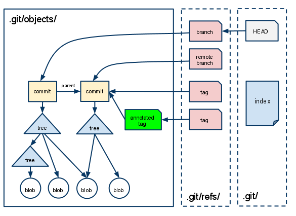

# Git 基本概念介绍

[TOC]

## git 工作空间介绍

git 三大工作空间  
- git 工作目录 *（就是操作系统的目录）*
- 暂存区 *（通过 `git add` 命令添加的文件/修改，在 .git 目录下）*
- git 本地仓库 *（通过 `git commit` 命令将修改提交到本地仓库，也 .git 目录下）*

*另外还有一个 git 的远程仓库，远程仓库是为了分布式开发时，大家进行代码进行共享和同步*

`git add` 添加文件到暂存区示例  


`git commit` 添加文件到本地仓库  


## git 中的一些概念
要理解 Git 内部构造的核心，我们应理解三个东西： **<font color='red'>实体、引用、 索引</font>**  

### 实体
- 提交到 git 代码仓库中的所有文件，包括每个提交的说明信息，目录结构等都会转换成 git 实体
- git 实体存放在 .git/objects/ 目录中
- git 中每个实体以一个 40 字符长度的十六进制字符串（该实体内容的SHA1哈希值，实际占 160 bit）来唯一标识


**git 中包括4中类型的实体**
- blob - 存储文件内容
- tree - 存储目录结构和文件名
- commit - 存储提交的作者、日期、说明等，组成 git 的提交图谱
- tag - 存储带注释的标签（tag）

### 引用
Git 中，一个分支（branch）、远程分支（remote branch）或一个标签（tag）（也称为轻量标签）仅是指向一个实体的一个指针，这里的实体通常是一个commit实体。这些引用以文本文件的形式存储在目录 .git/refs/ 中  
*符号引用（Symbolic References）*  
Git 有一种特殊的引用，称为符号引用。它并不直接指向一个实体，而是指向另一个引用。举例来说，.git/HEAD就是一个符号引用。它指向你正在工作的当前分支。

### 索引
索引是一个暂存区，以二进制文件的形式存储为文件 .git/index 中  
当`git add` 一个文件，git 将该文件的信息添加到索引中  
当`git commit`时，git 仅提交索引文件中列出的文件到 git 本地仓库  

下面通过一幅头来说明 git 中实体、引用、索引之间的关系  
  
.git/objects/  目录下存放着所有的实体  
.git/refs/  目录下存放着所有的引用  
.git/index  文件保存着索引信息  

### 示例：查看 git 实体
新建一个 git 仓库，并且添加一个 readme.txt 文件，并且提交到仓库后  


``` shell
$ mkdir gitdemo
$ cd gitdemo
$ git init
$ echo "readme file" >> readme.txt
$ git add .
$ git commit -m "init"

walle@DESKTOP-4HF815V MINGW64 /d/workspace-idea/gitdemo (master)
$ git log
commit c578b0be5d1f49f298630ffcee6695636ee2f0db
Author: walle <liaozhicheng.cn@163.com>
Date:   Sat Aug 12 19:02:51 2017 +0800

    init
```
首先通过`git log`命令查看有一个 commit 实体，其对应的 SHA1 值为：c578b0be5d1f49f298630ffcee6695636ee2f0db  

``` shell
walle@DESKTOP-4HF815V MINGW64 /d/workspace-idea/gitdemo (master)
$ git cat-file -p c578b0be5d1f49f298630ffcee6695636ee2f0db
tree 5a1e049dfea9034e5bf2a31799c1d5beb558da8e
author walle <liaozhicheng.cn@163.com> 1502535771 +0800
committer walle <liaozhicheng.cn@163.com> 1502535771 +0800

init
```
通过`git cat-file`命令查看该 commit 实体的内容，可以看到该 commit 实体中包含了一个 tree 实体，对应的 SHA1 值：5a1e049dfea9034e5bf2a31799c1d5beb558da8e，并且包含了提交的作者、时间和说明信息*（通常 commit 实体还会有一个 parent 属性，指向当前 commit 的上一个 commit 实体，因为该示例是整个仓库的第一次 commit，所以该 commit 不存在 parent）*

``` shell
walle@DESKTOP-4HF815V MINGW64 /d/workspace-idea/gitdemo (master)
$ git ls-tree 5a1e049dfea9034e5bf2a31799c1d5beb558da8e
100644 blob 0bb9011444ae6ccbf30fdbf8470eebde0007d398    readme.txt
```
通过`git ls-tree`命令查看 commit 实体中的 tree 实体，可以看到该 tree 实体中包含了一个 blob 实体，对应的 SHA1 值为：0bb9011444ae6ccbf30fdbf8470eebde0007d398，该 blob 的文件名为 readme.txt

``` shell
walle@DESKTOP-4HF815V MINGW64 /d/workspace-idea/gitdemo (master)
$ git cat-file -p 0bb9011444ae6ccbf30fdbf8470eebde0007d398
readme file
```
通过`git cat-file`命令查看 blob 实体的内容，可以看到该 blob 的内容就是我们提交的 readme.txt 文件的内容

### 扩展阅读：  
[通过示例学习Git内部构造](http://blog.xiayf.cn/2013/09/28/learning-git-internals-by-example/) *强烈推荐认真理解这篇文章中的示例*
