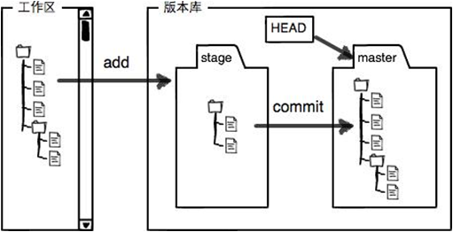

## Git 基本概念介绍

### 大纲

### git 工作空间

git 三大工作空间
- git 工作目录 *（就是操作系统的目录）*
- 暂存区 *（通过 `git add` 命令添加的文件/修改，在 .git 目录下）*
- git 本地仓库 *（通过 `git commit` 命令将修改提交到本地仓库，也 .git 目录下）*

*另外还有一个 git 的远程仓库，远程仓库是为了分布式开发时，大家进行代码进行共享和同步*

`git add` 添加文件到暂存区示例

`git commit` 添加文件到本地仓库

### git 概念
- 实体
- 引用
- 索引

### 实体

**git 实体说明**
- 你提交到 git 代码仓库中的所有文件，包括每个提交的说明信息，目录结构等都会转换成 git 实体
- git 实体存放在 .git/objects/ 目录中
- git 中每个实体以一个 40 字符长度的十六进制字符串（该实体内容的SHA1哈希值，实际占 160 bit）来唯一标识

**git 中包括4中类型的实体**
- blob - 存储文件内容
- tree - 存储目录结构和文件名
- commit - 存储提交的作者、日期、说明等，组成 git 的提交图谱
- tag - 存储带注释的标签（tag）

### 引用
Git 中，一个分支（branch）、远程分支（remote branch）或一个标签（tag）（也称为轻量标签）仅是指向一个实体的一个指针，这里的实体通常是一个commit实体。这些引用以文本文件的形式存储在目录 .git/refs/ 中

*符号引用（Symbolic References）*

Git 有一种特殊的引用，称为符号引用。它并不直接指向一个实体，而是指向另一个引用。举例来说，.git/HEAD就是一个符号引用。它指向你正在工作的当前分支。

### 索引
索引是一个暂存区，以二进制文件的形式存储为文件 .git/index
当 git add一个文件，Git 将该文件的信息添加到索引中。当 git commit，Git 仅提交索引文件中列出的文件。

下面通过一幅头来说明 git 中实体、引用、索引之间的关系

.git/objects/  目录下存放着所有的实体
.git/refs/  目录下存放着所有的引用
.git/index  文件保存着索引信息
