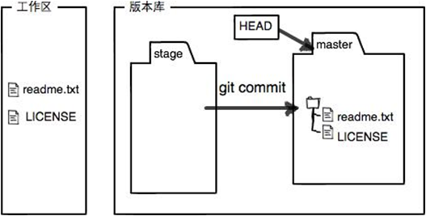

# Git 基本概念介绍

## 大纲
[TOC]

## git 工作空间

**git 三大工作空间**
- git 工作目录 *（就是操作系统的目录）*
- 暂存区 *（通过 `git add` 命令添加的文件/修改，在 .git 目录下）*
- git 本地仓库 *（通过 `git commit` 命令将修改提交到本地仓库，也 .git 目录下）*

*另外还有一个 git 的远程仓库，远程仓库是为了分布式开发时，大家进行代码进行共享和同步*

`git add` 添加文件到暂存区示例

`git commit` 添加文件到本地仓库

## git 概念

### 实体
你提交到 git 代码仓库中的所有文件，包括每个提交的说明信息都在目录 .git/objects/ 中存储为实体，一个实体以一个40字符长度的字符串（该实体内容的SHA1哈希值）来标识。
实体有4类:
- blob - 存储文件内容
- tree - 存储目录结构和文件名
- commit - 存储提交的说明，组成 Git 的提交图谱
- tag - 存储带注释的标签（tag）
