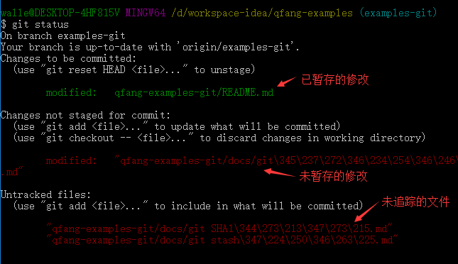
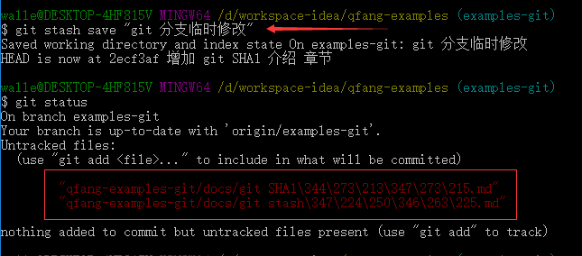
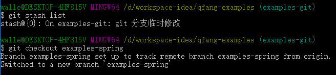
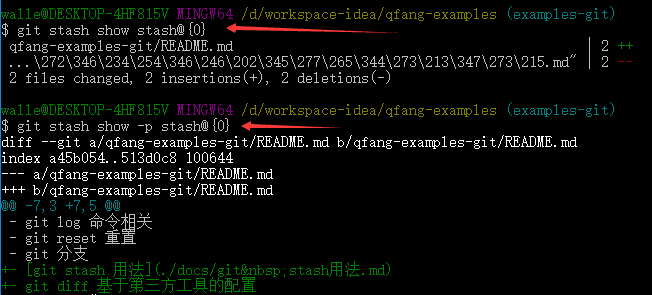

# git stash 用法

### git stash 使用的场景
git stash 类似 git 垃圾箱，用来在一些不得不提交但是又不想提交到 git 仓库中的情况下，例如：我们往往使用 branch 解决任务切换问题，我们会建一个自己的分支去修改和调试代码, 如果别人或者自己发现主干上有个不得不修改的 bug，我们往往会把完成一半的代码 commit 提交到本地仓库，然后切换到 master 去修改 bug，改好之后再切换回来。这样有个问题就是会导致 log 上会有大量不必要的记录。其实如果我们并不想提交完成一半的代码，但是却不得不去修改一个紧急 Bug，那么使用`git stash`就可以将你当前未提交到本地的代码推入到 git 的垃圾箱中，这时候你的工作区间和上一次提交的内容是完全一样的，所以你可以放心的切换分支去修改 Bug，等到修完Bug，提交到服务器上后，再使用`git stash apply`将以前进行到一半的工作还原回来。

### 涉及的命令
`git stash` 创建 stash，效果类似 `git reset --hard HEAD`，但是 stash 重置后是可以还原  
`git stash save <desc>` 保存并指定描述  
`git stash list` 列出所有 stash 内容  
`git stash show stash{0}` 显示修改的统计  
`git stash show –p stash{0}` 显示内容  
`git stash pop [<stash>]` 弹出指定内容  
`git stash clear` 放弃所有 stash 内容  
`git stash apply` 与 pop 类似，但是不移除 stash 中的内容  
`git stash drop` 放弃一个 stash  

### 使用示例
先使用 `git status` 查看下当前分支的修改，这里为了演示我们保留了三种修改类型，包括已暂存的修改，未暂存的修改和未追踪的文件  
  

`git stash` 之后，我们可以看到工作目录和暂存区都被还原了，但是未追踪的文件还存在工作目录中，所有说 `git stash` 命令效果上类似于 `git reset --hard HEAD` 命令  
  

`git stash list` 查看 stash 列表，这样可以放心的执行 `git checkout` 命令切换到其他分支了  
  

`git stash show` 命令  
  

`git stash pop` 命令  
如果需要还原 stash，可以使用命令 `git stash pop` 命令还原最后一次 stash 点，如果需要还原不是最后一次 stash 的点，可以使用 `git stash pop stash@{2}` 命令，还原前两个 stash 的点
