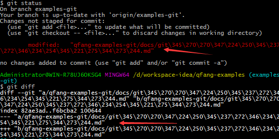
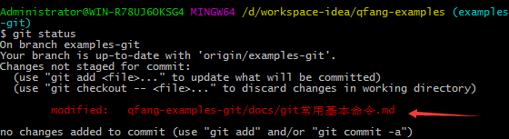

# git 常见问题总结-配置相关

### git bash 对于中文路径显示为数字问题解决办法  
默认情况下 git bash 对于中文的路径会进行编码，这样导致在使用`git status, git diff`等命令时无法直接看到改动的文件名，如下：  
  
**解决办法：**  
`$ git config --global core.quotepath false`  
之后再使用`git status`查看可以正常显示中文文件名了
  
