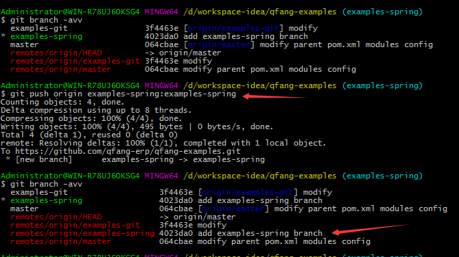
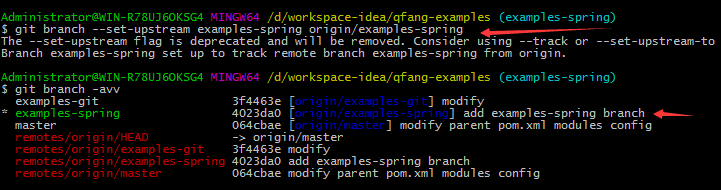
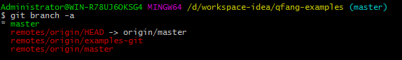
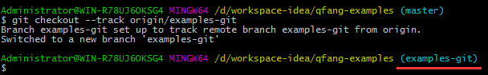
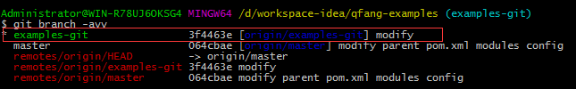

# git 远程分支

### 推送本地分支到远程仓库
`$ git checkout -b examples-spring` # 创建一个新的分支  
修改并提交，之后将本地分支推送到远程仓库  
`$ git push origin examples-spring:examples-spring` # 推送本地 examples-spring 到 origin/examples-spring  
语法：git push origin local_branch:remote_branch
  
发现多了一个远程分支，然后将本地分支和远程分支进行关联  
`$ git branch --set-upstream-to examples-spring origin/examples-spring`  

### 将远程分支拉取到本地分支
远程有个 origin/examples-git 分支，现需要将该远程分支拉倒本地 examples-git 分支

使用命令：  
`$ git checkout --track origin/examples-git`
  
执行之后本地创建了 examples-git 分支，并且将本地分支和远程分支直接建立了关联 (--track 参数)

### 删除远程分支
`git push origin :remote_branch`
